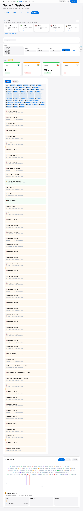

# Game Analyzer — Game BI & Competitor Intelligence Platform

Full-stack POC for game producers and live-ops teams: scrape public reviews (Steam / TapTap / Google Play), build BI dashboards, generate AI/rule reports, archive and share with teams.



**Showcase:** `/showcase` · **Resume bullets:** [docs/RESUME.md](docs/RESUME.md) · **Architecture:** [docs/PROJECT_SHOWCASE.md](docs/PROJECT_SHOWCASE.md)

## Live demo

| Method | Command / URL |
|--------|----------------|
| Local | http://127.0.0.1:8080/showcase |
| Share publicly | `./scripts/share_demo.sh` → `cat /tmp/game-analyzer-tunnel.url` |
| Stable cloud | [docs/DEPLOY.md](docs/DEPLOY.md) (Fly.io / Railway) |
| **Demo video** | `docs/demo/game-analyzer-demo.mp4` — `./scripts/record_demo_video.sh` |

Demo login: `demo` / `demo123`

## Quick start

```bash
cd game_analyzer
python -m venv .venv && source .venv/bin/activate
pip install -r requirements.txt
./scripts/dev.sh
```

`scripts/dev.sh` prefers the project `.venv`, which avoids accidentally using a
parent or system Python. Direct command:
`.venv/bin/python -m uvicorn src.web_app:app --host 127.0.0.1 --port 8080 --reload`.

- Home: http://127.0.0.1:8080  
- Dashboard: http://127.0.0.1:8080/dashboard  
- Showcase (portfolio): http://127.0.0.1:8080/showcase  

Demo login (development): `demo` / `demo123`

## Features

| Module | Description |
|--------|-------------|
| BI Dashboard | Dynamic product/genre/period filters, KPI cards, charts |
| Analysis Wizard | AppID or game name → report → archive |
| Competitor Workbench | Six-dimension comparison + AI summary |
| Team Collaboration | Shared archives, member management |
| Commercial POC | Plans, API quotas, demo payment |

## Tech stack

- **Backend:** Python 3.11, FastAPI, Pandas, SQLite  
- **Frontend:** Server HTML + modular JS (`dashboard-filters.js`, `app-nav.js`)  
- **Quality:** pytest, Playwright E2E, GitHub Actions CI  
- **Deploy:** Docker Compose, Fly.io ([docs/DEPLOY.md](docs/DEPLOY.md))

## Tests

```bash
chmod +x scripts/run_tests.sh
./scripts/run_tests.sh                    # unit tests (CI parity)
PLAYWRIGHT_CHANNEL=chrome ./scripts/run_browser_e2e.sh
```

## Production

```bash
cp .env.example .env   # SECRET_KEY, ALLOW_DEMO_ACCOUNTS=false for real prod
docker compose up -d --build
```

See [docs/DEPLOY.md](docs/DEPLOY.md) for Fly.io / Railway.

## Portfolio

- [Resume material (STAR bullets)](docs/RESUME.md) — CN/EN, interview talking points  
- [Project showcase](docs/PROJECT_SHOWCASE.md) — architecture, screenshots  
- [Publish to GitHub](docs/GITHUB_PUBLISH.md) — standalone repo for recruiters  
- [Case study: CS vs Dota 2](docs/CASE_STUDY_CS2_DOTA2.md) — demo script  
- [Commercial demo script](docs/COMMERCIAL_DEMO.md) — 5-minute walkthrough  

Chinese README: [README.md](README.md)
