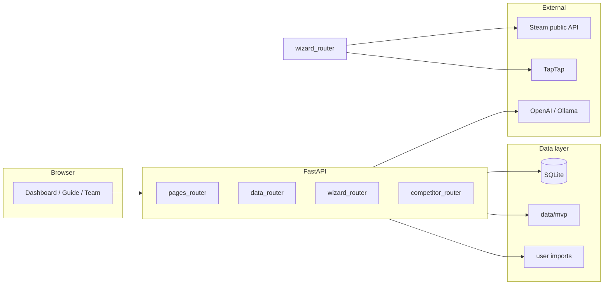
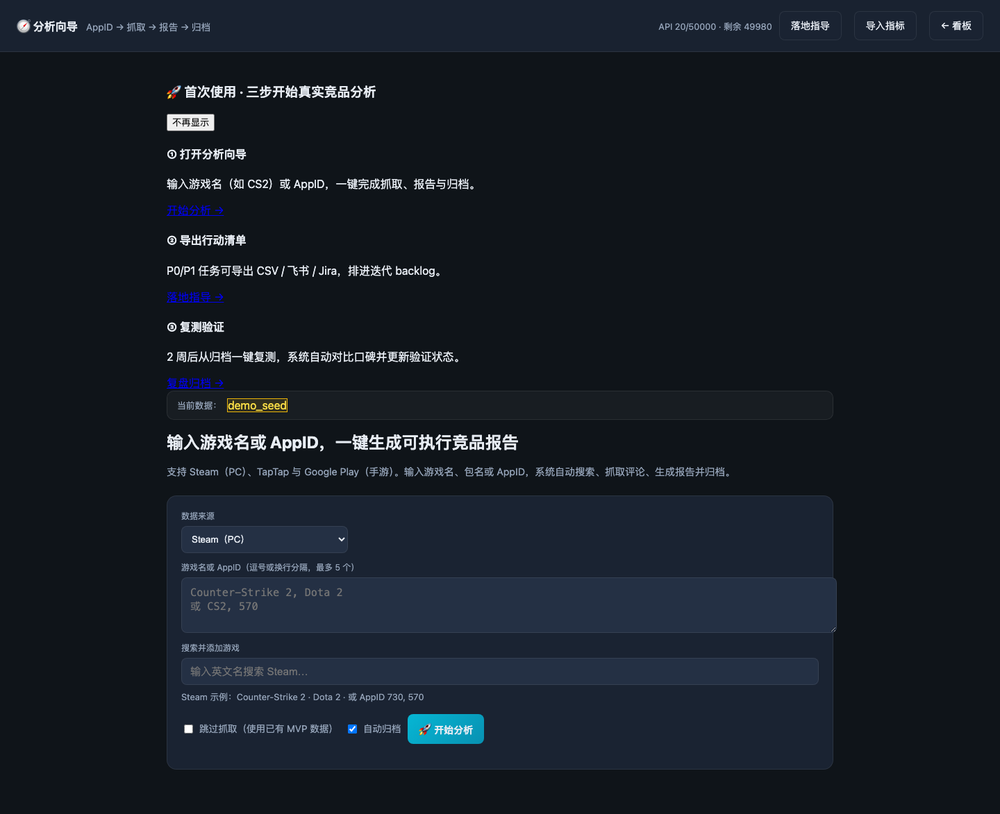
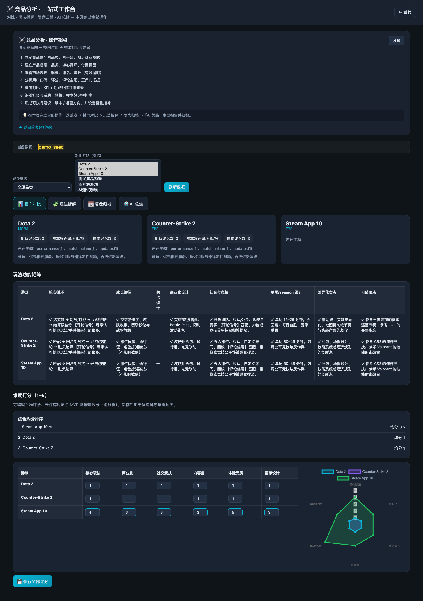
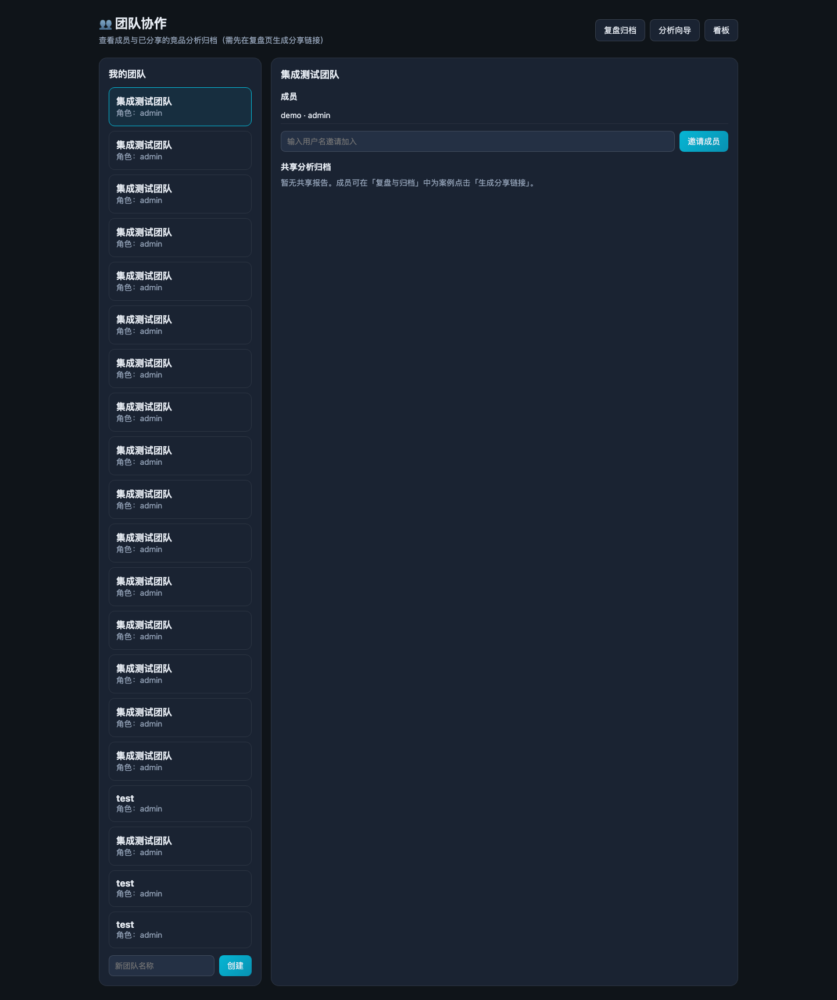
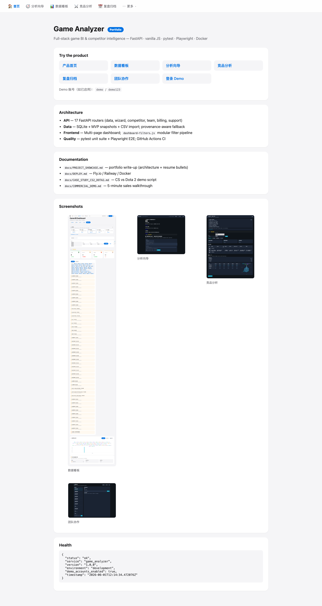

# Game Analyzer — Project Showcase

> **Game Analyzer** is a full-stack game BI and competitor intelligence platform.  
> From public review scraping to actionable reports, team archives, and retest loops.

## Live Demo

| Option | How |
|--------|-----|
| **Local** | `uvicorn src.web_app:app --port 8080` → http://127.0.0.1:8080/showcase |
| **Public tunnel** | `./scripts/share_demo.sh` → copy URL from `/tmp/game-analyzer-tunnel.url` |
| **Cloud (stable)** | Fly.io / Railway — see [DEPLOY.md](./DEPLOY.md) |

Set `PUBLIC_DEMO_BASE_URL=https://your-domain` so `/showcase` shows the public link banner.

| Page | Path | Purpose |
|------|------|---------|
| Showcase | `/showcase` | Portfolio overview |
| Product home | `/` | Landing + one-click demo |
| Dashboard | `/dashboard` | KPI / filters / charts |
| Analysis wizard | `/guide` | Scrape → report → archive |
| Work guidance | `/work` | Action backlog + export |
| Team | `/team` | Shared reports |

Default demo account (when enabled): `demo` / `demo123`

## Resume material

Full STAR bullets (CN/EN): **[docs/RESUME.md](./RESUME.md)**  
Publish standalone GitHub repo: **[docs/GITHUB_PUBLISH.md](./GITHUB_PUBLISH.md)**

### STAR highlights

1. **Unified data catalog** — merged CSV / MVP Steam / mock sources; fixed dashboard filter + server-side `/api/metrics` KPI pipeline (`data_catalog.py`, `dashboard-filters.js`).
2. **End-to-end analysis loop** — wizard → report → archive → team share → retest; reproducible CS2/Dota2 case via `./scripts/seed_demo.sh`.
3. **Engineering** — 170+ pytest cases, Playwright E2E, GitHub Actions CI, Docker/Fly/tunnel deploy docs.

## Architecture

## Tech stack

| Layer | Choices |
|-------|---------|
| Backend | Python 3.11, FastAPI, Pandas, SQLite |
| Frontend | Server-rendered HTML + vanilla JS modules |
| Auth | JWT, plan-based API quotas, IP/device rate limiting |
| Testing | pytest (170+ cases, 40+ modules), Playwright E2E |
| Deploy | Docker Compose, Fly.io / Railway, Cloudflare quick tunnel |

## Core capabilities

1. **Multi-source data** — user CSV import, MVP Steam snapshots, mock fallback with provenance badges
2. **BI dashboard** — dynamic product/genre filters, server-side metrics API, KPI cards
3. **Analysis wizard** — Steam AppID / TapTap name → structured report + P0/P1 actions
4. **Competitor workbench** — six-dimension scores, AI/rule summaries
5. **Collaboration** — archive sharing, team libraries, retest comparison
6. **Commercial POC** — pricing tiers, API usage metering, demo payment flow

## Case study (resume bullet source)

See [CASE_STUDY_CS2_DOTA2.md](./CASE_STUDY_CS2_DOTA2.md) — Counter-Strike vs Dota 2 public review analysis with reproducible `./scripts/seed_demo.sh` data.

## Engineering highlights

- `dashboard-filters.js` — extracted filter catalog + metrics pipeline from 7k-line dashboard
- `data_catalog.py` — merges metrics, game library, and MVP analysis for filter options
- `metric_matches_period()` — shared period alias logic (Q2 ↔ `quarter_2`) across API and UI
- GitHub Actions CI — unit tests on every push to `game_analyzer/`

## Resume one-liner

*Built a full-stack game analytics SaaS POC (FastAPI + vanilla JS) with multi-platform review ingestion, BI dashboards, LLM/rule hybrid reporting, team collaboration, 170+ pytest cases, and deploy docs for Docker / Fly.io / Cloudflare tunnel.*

## Screenshots

Captured with `./scripts/capture_screenshots.sh` (also copied to `src/static/img/showcase/`):

| | |
|---|---|
|  |  |
|  |  |

